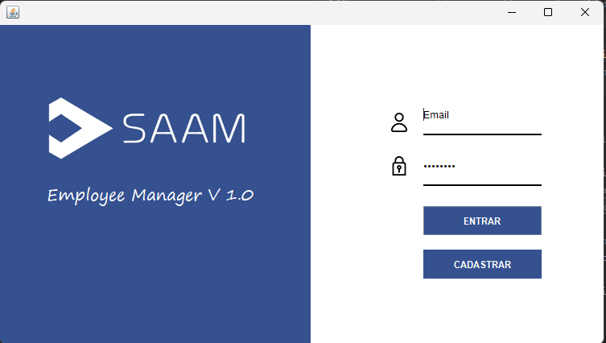
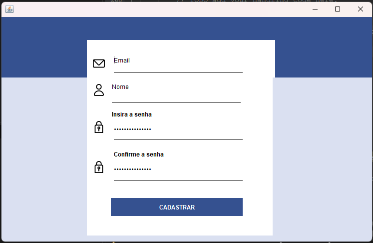
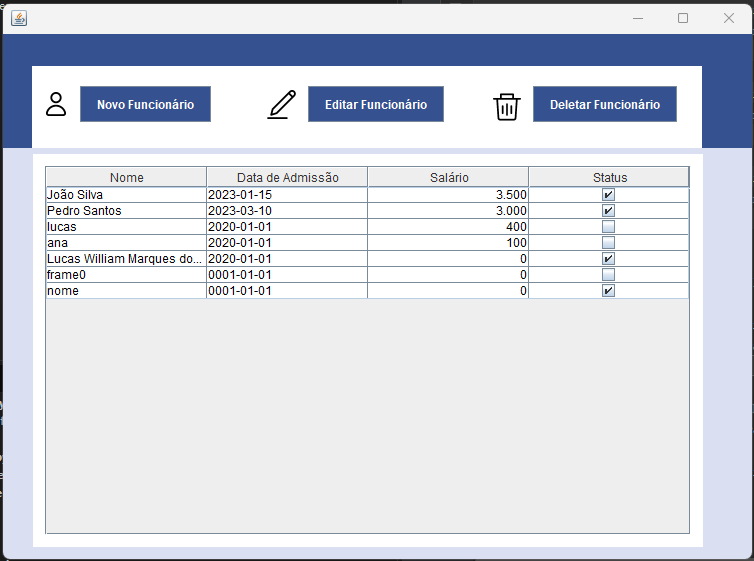
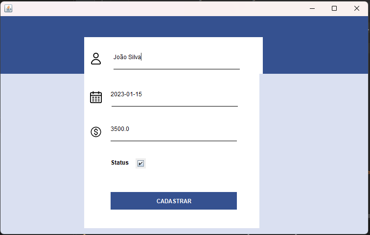

# Employee-Manager

## 📃 Introdução

Este projeto visa disponibilizar uma aplicação Desktop para realizar consultas e registros de dados de funcionários. Além de gerenciar o acesso à aplição utilizando sistema Singleton de autentificação.

## 💻 Tecnologias usadas:

- #### Linguagem: Java

- Swing (Biblioteca gráfica)
- PostgreSQL (Banco de dados relacional)
- Flyway (Migração de Banco de dados)

## 💾 Instalações
Instalações necessárias :
 - **Localmente** : Para execução local da aplicação é necessário ter instalado [PostgreeSQL]((https://www.postgresql.org/download/)), [Java](https://www.java.com/pt-BR/download/) (recomendável 17) e [Maven](https://maven.apache.org/download.cgi).

## 💿 Rodando a aplicação
**Local** : Para iniciar a aplicação localmente deve-se adicionar um banco de dados PostgreSQL com os parametros definidos em src\main\resources\database.properties e executar os seguintes comandos para buildar a aplicação e executa-la:

    $ mvn package
    $ java -jar target/EmployeeManager-1.0-SNAPSHOT.jar

## 📖 Interface gráfica

- ### Tela inicial de Login
  

- ### Tela de cadastro de conta
  
  
- ### Tela de acesso a dados de funcionários
  
 
- ### Tela de cadastro ou atualização de funcionários
  

## 💡 Possíveis pontos de avanço

- Implementação de classes de teste
- Implementação do design pattern factory para o acesso da conexão com o banco de dados
- Dockerização da aplicação
- Implementação de monitoramento de LOGs 

## ☕ Considerações finais
Este projeto foi criado com doses generosas de café.

[Contato Linkedin](https://www.linkedin.com/in/dev-lucas-marques-sjc/)
